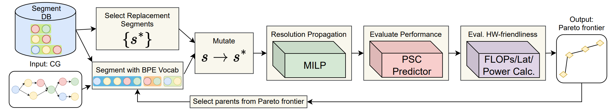

# Automated Computation Graph Optimization for Neural Network Evolution

<p align="center">
    <a href="https://nips.cc/" alt="Conference">
        </a>
    <a href="https://github.com/Ascend-Research/AIO-P/blob/master/LICENSE" alt="License">
        </a>
    <a href="https://www.python.org/" alt="Python">
        </a>
    <a href="https://pytorch.org/" alt="PyTorch">
        </a>
    <a href="https://www.tensorflow.org/" alt="TensorFlow">
        </a>
<p/>

Repository for the paper
> [AutoGO: Automated Computation Graph Optimization for Neural Network Evolution](https://openreview.net/login?redirect=%2Fforum%3Fid%3DlDI3ZuyzM9) \
> Mohammad Salameh, Keith G Mills, Negar Hassanpour, Fred X. Han, Shuting Zhang, Wei Lu, Shangling Jui, Chunhua Zhou, 
> Fengyu 
> Sun, Di Niu \
> NeurIPS 2023

[[Poster](https://kgmills.github.io/assets/posters/AutoGO_NeurIPS23_poster.pdf)][[Video](https://nips.cc/virtual/2023/poster/70604)][[Slides](https://kgmills.github.io/assets/slides/AutoGO_NeurIPS23_slides.pdf)]

<p align="center">
  
</p>

This repository provides access to, and instructions to perform the following:
- The AutoGO search algorithm, our segment database, with the ability to train CIFAR-10 models
- The scripts and files necessary to generate the segment database
- Sample CGs the user can use to make new architectures.
- Generating data for the PSC predictor and a demo on how to train it.
- Guide on how to convert a Computational Graph into either a PyTorch or TensorFlow model which can then be trained elsewhere.


## Setup
### Setting Up A Conda Environment
Please see the supplementary material PDF for a full description of our computing platform. We run our experiments on an Ubuntu 20.04 LTS. 
Our conda environment for running AutoGO consists of the following (primary) Python 3.7 packages:
```
- tensorflow-gpu==1.15.0
- keras==2.3.1
- pytorch==1.8.1
- pytorch_geometric==1.7.2
- swig==4.1.0
- OApackage==2.7.2
- matplotlib
- seaborn
- sentencepiece==0.1.96
- gpytorch==1.3.0
- grakel==0.1.8
- ConfigSpace==0.4.12
- pyomo==6.4.0
- graphviz==0.20
```

### Getting the Necessary Data Files
Download the CG cache files from the public [Google Drive folder](https://drive.google.com/drive/folders/1nTj8g6XbIU_PYvOBaXjylBHmgo-3okra) provided by [GENNAPE](https://github.com/Ascend-Research/GENNAPE).

Place the `.json` files for HiAML, Inception and Two-Path into `/data/`.
Also place the `.pkl` files for NAS-Bench-101 (`nb101`) and NAS-Bench-201 on CIFAR-10 (`nb201c10`) into `/data/`.
Then, run the following to generate a 5k subset of NAS-Bench-101. 
```
python gen_nb101_5k.py
``` 
This will generate a new cache file for NB-101 containing the 5k architecture subset we use to make the DB.

## AutoGO Search Algorithm and Training the Predictor
**Disclaimer:** Some of the tasks that this code can execute require a lot of computational resources, specifically RAM. It may not be feasible to perform some of them on your home computer.

The primary experiments provided by this code submission are:
- Running the AutoGO search algorithm
- Training the PSC predictor which guides search.

Both of these experiments require several auxiliary files in order to execute (e.g., search requires a predictor checkpoint). We provide preliminary instructions on generating these files, but also provide them in the code submission if the upload size limit permits.

### Search Algorithm Preliminary Files
The AutoGO search algorithm requires the following files to run:
- **Graph Encoder** and **SentencePiece Tokenizer**: Provided at `/cache_sentence_piece/h+i+n15+n2+t/h+i+n15+n2+t_encoder_shp.pkl` and `/cache_sentence_piece/h+i+n15+n2+t/models/h+i+n15+n2+t_vsize2000_bpe_shp.model`, respectively. Both can be created from scratch (files must be downloaded from Google Drive and placed in `/data/` first) by running 
```
python gen_vocab.py
```
- **Segment Database**: Provided at `/cache_sentence_piece/h+i+n15+n2+t/combined_segment_DB_res_ratio.pkl` and can then be generated (requires Graph Encoder and SentencePiece Tokenizer to exist) using 
```
python gen_DB.py
```
- **Input Architecture CG**: We provide `.pkl` files for our provided input architectures in `/architectures/` and provide instructions on generating CGs from TensorFlow models in a later section of this README.
- **Predictor Checkpoint**: The PSC and GNN predictor checkpoints are located at `/saved_models/{psc_chkpt, gnn_chkpt}.pt`, respectively. We also provide detailed instructions on training both models from scratch in a later part of this README.

### Running AutoGO on an input architecture
An example command that runs AutoGO on the best NAS-Bench-201 CIFAR-10 architecture is provided below:

```
python autogo.py -model_path architectures/nb201_best.pkl -model_family nb201 -predictor_path saved_models/psc_chkpt.pt -predictor_type PSC_predictor -input_h 32 -input_w 32 -input_c 3 -epoch 10 -top_k 10 -max_candidate_per_iter 10 -max_target_per_iter 100 -num_train_cgs -1 -min_flops_decrease_percent -10 -max_flops_decrease_percent 100 -mutation_unit segment
```

#### Explanation of each option
- `model_path` is the input Compute Graph as a `.pkl` file or `.pb` file.
- `model_family` controls the permitted operations for mutation. For the CIFAR-10 families, it should be those families e.g., `hiaml` or `nb201`. For other architectures it should be `edsr`, `generic` or `generic_noDW` depending on whether you want to permit Depthwise Convolutions. See the `OPS` dict in `constants.py`
- `predictor_path` should be `saved_models/{psc_chkpt, gnn_chkpt}.pt`
- `predictor_type` should be `{PSC_predictor, GNN}`
- `input_h`, `input_w` and `input_c` control the input tensor size to the CG and all children.
- `epoch` is number of iterations
- `top_k` is the number of architecture parents selected from the pareto frontier per iteration
- `max_candidate_per_iter` is the number of source segments to consider per parent.
- `max_target_per_iter` is the number of replacement segments to consider per source segment.
- `num_train_cgs` is the number of child CGs on the Pareto frontier (from high-acc, high FLOPs to low-acc, low-FLOPs) to train after search finishes. `-1` means train all CGs. **Note:** This param should be `0` for non-CIFAR-10 architectures, as other/bigger networks can be instantiated into Torch/TF models (see `model_demo.ipynb` and `model_src/comp_graph/transfer_demo.ipynb`) and trained using other APIs, e.g., [timm](https://github.com/huggingface/pytorch-image-models) or [ECBSR](https://github.com/xindongzhang/ECBSR).
- `min_flops_decrease_percent` Allowed FLOPs increase, e.g., `-10` means the model can be up to 10% larger than the CG described in `model_path`.
- `max_flops_decrease_percent` Allowed FLOPs decrease, e.g., `100` means AutoGO can freely reduce FLOPs; `20` means reduce FLOPs by at most 20% of the CG described by `model_path`.
- `-mutation_unit` 'segment' or 'op' mutation.

**Note #1:** This demo is for CIFAR-10 architectures. For other architectures, e.g., the EDSR architectures we provide in `model_demo.ipynb`, you should set `-num_train_cgs 0`. AutoGO will output a log directory in `/outputs/` that contains the architectures on the Pareto frontier, which can then be instantied as TensorFlow/PyTorch models later.

**Note #2:** The search process does not require that much VRAM (unless using `parallel`, see below), but evaluation of Pareto frontier CGs afterwards can consume a lot. Specifically, the NB-101 and Inception families consume a lot of VRAM. Moreover, `autogo.py` contains a lot of additional flags that control how to train CIFAR-10 models, e.g., epochs, batch_size.

**Note #3:** By default, this search algorithm is sequential. To make it parallel, adjust the `-n_jobs` flag.

**After Search**: Once search is complete, you will be able to find the results of your experiment in the folder `/outputs/{model_family}_{mutation_unit}_epoch_{epochs}_max_target_{max_target}_top_k_{top_k}_{predictor_type}_{YYYYMMDD}_{HHMMSS}/` where everything in curly braces is either an argument to the `autogo.py` script or the system date at time of execution. This folder will contain:
- `params.pkl`: Pickle file containing the argparse.
- `mutation_result.txt`: Text file containing information on architectures from the Pareto frontier (change in FLOPs, change in nodes, iteration it was found, etc.), as well as diagnostic information, e.g., about the MILP and total amount of architectures visited.
- `input_arch.png` and `rank_X.png` images: These are diagrams of the CGs of the input architecture and all mutants on the Pareto frontier. Nodes are colored according to their corresponding segments (**Note:** When segmentation is done to produce these images, we use the full BPE vocabulary)
- `mutant_X.png` images: These are like the `rank_x.png` images, except only the nodes that do not exist in the input architecture are colored. In other words, the mutant drawings illustrate the changes AutoGO has made to produce the architecture.
- `train_result.txt` if you trained CIFAR-10 architectures, the results will be found here.


### Training the PSC and GNN predictors
For both predictors we have already set the default parameters to their top-level script files.
Additional data processing is required to generate the PSC training caches for the PSC predictor. These files are 
very large, so we provide instructions on how to generate them here

**Note #1:** `gen_vocab.py` should've already been ran as the **Graph Encoder** and **SentencePiece Tokenizer** are required to generate the caches.

**Note #2:** Generating the PSC caches and training the predictor is very computationally expensive, in terms of time and hard disk space, and requires a machine with RAM exceeding 128GB in the case of some families.

For each family in `{nb101, nb201c10, hiaml, inception, two_path}`, first run
```
python run_psc_segment.py -data_family $FAMILY
```
This will generate the segments. Then, run
```
 python make_segment_predictor_cache_sa.py -data_family $FAMILY
```
This will generate a file in `/cache/`.

Run the PSC predictor as:
```
python run_gpi_segment_predictor.py
```
This will save a log file in `/logs/` and checkpoint `.pt` files in `/saved_models/`

#### The GNN baseline predictor can be ran using:
```
python run_cg_kgnn_predictor.py
```
The same rules apply here for logging, and model checkpoints, as they do for the PSC predictor. The checkpoint `.pt` files can then be used during AutoGO search.


## Examples of Found Architectures, Loading Architectures Outside of this repo/for HPE/Segmentation and Misc. Information
Please see demos in `model_demo.ipynb` and `model_src/comp_graph/transfer_demo.ipynb` as well as the `/architectures/` folder.

### Bibtex 
If you find our framework useful, we kindly ask that you cite our paper:
```
@inproceedings{salameh2024autogo,
 author = {Salameh, Mohammad and Mills, Keith G. and Hassanpour, Negar and Han, Fred and Zhang, Shuting and Lu, Wei and Jui, Shangling and Zhou, Chunhua and Sun, Fengyu and Niu, Di},
 booktitle = {Advances in Neural Information Processing Systems},
 editor = {A. Oh and T. Neumann and A. Globerson and K. Saenko and M. Hardt and S. Levine},
 pages = {74455--74477},
 publisher = {Curran Associates, Inc.},
 title = {AutoGO: Automated Computation Graph Optimization for Neural Network Evolution},
 url = {https://proceedings.neurips.cc/paper_files/paper/2023/file/eb5d9195b201ec7ba66c8e20b396d349-Paper-Conference.pdf},
 volume = {36},
 year = {2023}
}
```
